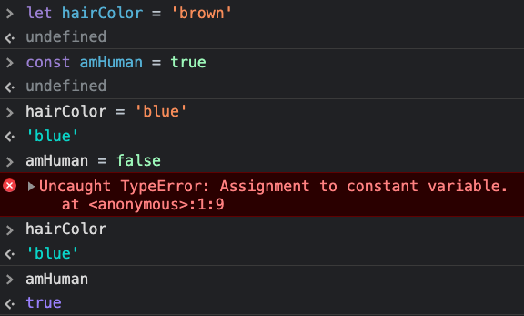

# Values and Expressions

**Instructor Notes:**

- No starter repo for this.
- Create a repo named `${cohortName}-js-foundations`
- Do a quick refresher on making the files you'll need for lecture. Students often don't know they can create two files, like:
  - `touch index.html valuesAndExpressions.js`
- Here's an example of what the finished JS file ends up looking like:
- <details>
    <summary>Finished Lecture Code</summary>

    ```js
    // -------------------------------------------------
    // VARIABLES ---------------------------------------
    // -------------------------------------------------

    // We can do TWO things with variables:
      // 1. Declare (AKA: create) them.
      // 2. Assign values to them.

    // Here, we do both of these things on a single line of code:
      // 1. Declare a variable named myBirthday.
      // 2. Assign a value of '4-26-1986' to the variable myBirthday.
    let myBirthday = '4-26-1986';


    // 1. Declare a variable named yourBirthday.
    let yourBirthday;
      // This 👆 variable has not been assigned a value. Conceptually, it's
      // fair to think of it as an empty box. To be precise, because we
      // have not assigned it a value, its current value is `undefined`.

    // 2. Assign a value of '2-8-1992' to the variable yourBirthday.
    yourBirthday = '2-8-1992';
      // Because this variable's value was `undefined`, it's accurate to say
      // that this line of code is *overwriting* the value `undefined` with
      // the string value '2-8-1992'.

    
    // -------------------------------------------------
    // CHECKING VALUES' DATATYPES ----------------------
    // -------------------------------------------------

    console.log(typeof true);           // 'boolean'
    console.log(typeof 'dog');          // 'string'
    console.log(typeof 3.14);           // 'number'
    console.log(typeof {name: 'Elmo'}); // 'object'
    console.log(typeof [1,2,3]);        // 'object' (told you so!)


    // -------------------------------------------------
    // UNEXPECTED EVALUATIONS BECAUSE OF DATATYPES -----
    // -------------------------------------------------

    console.log("5 - '10' is:", 5 - '10');   // -5
    console.log("5 * '10' is:", 5 * '10');   // 50
    console.log("5 + '10' is:", 5 + '10');   // '510'
    console.log("5 / 'cat' is:", 5 / 'cat'); // NaN


    // -------------------------------------------------
    // EXPRESSIONS EVALUATE TO VALUES ------------------
    // -------------------------------------------------

    // Example of an expression:
    5 + 10 - 55
    // 👆 this is an expression that evaluates to -40

    // Declare three variables and assign each one a value:
    let day = '31';
    let year = '1990';
    let month = '5';

    let sistersBirthday = month + '-' + day + '-' + year;
    // What are we doing here? 👆
      // 1. Declaring a variable named sistersBirthday.
      // 2. Assigning a value to the variable. This value will be
      //    the result of an evaluated expression.
    // The EXPRESSION: month + '-' + day + '-' + year
      // This is an expression because we don't immediately
      // know what its value is. The computer needs to do some
      // work to figure out what value to assign to the
      // sistersBirthday variable.
    // How the computer evaluates this expression, step-by-step:
      // 1. What is month? Do I know about a thing labelled month?
      // 2. Yep! Found a variable called month! Its value is '5', so
      //    I've partially evaluated this expression to arrive at:
      //      '5' + '-' + day + '-' + year
      // 3. I need to add '5' and '-' together. No sweat, I'm
      //    making progress:
      //      '5-' + day + '-' + year
      // 4. I need to add '5-' and day. What is day? Do I know
      //    about a thing labelled day?
      // 5. Yep! Found a variable called day! its value is '31', so
      //    I've made even more progress evaluating this expression:
      //      '5-'31' + '-' + year
      // 6. The computer continues to follow this step-by-step process
      //    of evaluation:
      //      '5-31' + '-' + year
      //      '5-31-' + year
      //      '5-31-' + '1990'
      // 7. Finally, the expression is finished being evaluated, and
      //    I have discovered that its value is:
      //      '5-31-1990'
      // 8. Now that I know the value, I assign it to the sistersBirthday
      //    variable.

    // We can verify this entire step-by-step process works by
    // documenting our expectation and comparing it the actual
    // value of the sistersBirthday variable:
    console.log('Expect 5-31-1990 ==>', sistersBirthday);


    // -------------------------------------------------
    // PRIORITIZE READABILITY IN EXPRESSIONS -----------
    // -------------------------------------------------

    // This variable ends up with the exact same value as
    // sistersBirthday. But, the expression used to arrive
    // at the value here is more readable:
    let sistersBirthdayAgain = `${month}-${age}-${year}`;


    // -------------------------------------------------
    // FUNCTIONS ALSO EVALUATE TO VALUES ---------------
    // -------------------------------------------------

    // This function has no return value specified:
    function sayHi() {
      console.log('hi');
    }

    // This function has a return value:
    function tripleIt(numberToTriple) {
      return numberToTriple * 3;
    }

    // Calling these two functions and caputuring their
    // return values in variables:
    let sayHiOutput = sayHi();
    let tripleItOutput = tripleIt(3);

    // Using console.log to find out what each function
    // evaluated to:
    console.log('sayHiOutput:', sayHiOutput);
    // results in undefined
    console.log('tripleItOutput:', tripleItOutput);
    // results in 9


    // -------------------------------------------------
    // TRUTHY VS FALSY VALUES --------------------------
    // -------------------------------------------------

    let name = 'Matt';

    if (name) { // 👈 "if the value of name is something that exists"
      console.log(`Hello ${name}.`);
    } else {
      console.log('Hello. I guess you do not have a name.');
    }

    let age = 0;

    if (age) { // 👈 "if the value of age is something that exists"
      console.log(`You are ${age} years old!`);
    } else {
      console.log('Hopefully you have a birthday party coming up soon.');
    }

    ```
  </details>

**Conceptual Goals:**

- Make the distinction between variable declaration and value assignment.
- Know that every value has a datatype, which can be primitive or reference.
- Visualize how a computer evaluates a single expression.
- Learn the vocabulary to talk precisely about code with other humans.
- Introduce the idea of truthy/falsy values.

---

## A More Precise Understanding of Variables

### Declaring Variables and Assigning Them Values:

A lot of what our code does is instruct the computer to remember some stuff for later. The most basic way we do this is with variables.

```js
// ***************************************************
// We can do TWO things with variables:
  // 1. Declare (AKA: create) them.
  // 2. Assign values to them.

// Here, we do both of these things on a single line of code:
  // 1. Declare a variable named myBirthday.
  // 2. Assign a value of '4-26-1986' to the variable myBirthday.
let myBirthday = '4-26-1986';

```

This 👆 line of code actually does two things:
- **Declare** a variable
- **Assign** a value to the variable

We need not *always* do these two things together:

```js
// 1. Declare a variable named yourBirthday.
let yourBirthday;
  // This 👆 variable has not been assigned a value. Conceptually, it's
  // fair to think of it as an empty box. To be precise, because we
  // have not assigned it a value, its current value is `undefined`.

// 2. Assign a value of '2-8-1992' to the variable yourBirthday.
yourBirthday = '2-8-1992';
  // Because this variable's value was `undefined`, it's accurate to say
  // that this line of code is *overwriting* the value `undefined` with
  // the string value '2-8-1992'.
```

**Metaphor**: A variable is like a cardboard box. 

- The **name** we choose to give a variable is the **label** on the box.
- The **value** we assign to a variable is what's **inside** the box. 
 
We can put whatever label we want on the box, but what's inside is what matters to the computer. Choosing descriptive labels for things is our main opportunity to write code that our teammates and future-selves will be able to comprehend.

### `let` vs `const` vs `var`:

Don't use `var`! It used to be *the only option* for declaring variables in JS. It behaves slightly differently than `let`/`const`. We'll leave it there for now.

- `let`: Declares a variable whose **value is reassignable**.
- `const`: Declares a *constant* variable whose **value cannot be reassigned**.




- We can reassign the value of `hairColor`.
- Attempting to reassign the value of `amHuman` results in an error.

---

## Values and Expressions: The Foundation of Code

### Types of Values:

In JS, all values are of a certain **datatype**. There are two categories of datatypes:
1. Primitive
2. Reference

#### The Seven Primitive Datatypes:

**Mental model**: Primitive datatype values are like **atomic particles**.

Here are the ones you'll use:
1. Undefined: `undefined`
2. Null: `null`
3. Booleans: `true` or `false`
4. Numbers: `23` or `3.14`
5. Strings: `'yay for strings'`

Here are two other odd ones that you won't typically have a use case for:

6. Symbols: `Symbol('wand')`
    - You don't need these unless you are planning on doing some very advanced wizardry.
7. BigInts: `282593827185n`
    - You don't need this unless you're working with *really* big numbers.


#### The Two Reference Datatypes:

There are two **reference datatypes**:
1. Functions:
    - **Mental model**: Lil' machines that you can create and use--they **do stuff**.
2. Objects:
    - **Mental model**: Objects are like value **molecules**--they are collections of values.
      - Fun fact: In JS, arrays are technically objects.

#### On Checking Datatypes of Values:

If you ever need to know a given variable's current datatype, JS provides the `typeof` keyword. We use it like so:
```js
console.log(typeof true);           // 'boolean'
console.log(typeof 'dog');          // 'string'
console.log(typeof 3.14);           // 'number'
console.log(typeof {name: 'Elmo'}); // 'object'
console.log(typeof [1,2,3]);        // 'object' (told you so!)
```

#### On Datatype-Related Evaluation Surprises:

How do you think JS will evaluate these three expressions?
```js
5 - '10';
5 * '10';
5 + '10';
```

Try it out. 🙂 We're entering the world of **JS Trivia**, which is an often confusing world. Don't go there today. Just know that *the datatypes of the values within a given expression impact how it is evaluated*, often surprisingly. (We don't like when our code surprises us!)

#### On `NaN`:

`NaN` is a special value that expressions can evaluate to. It stands for **not a number**.

How do you think JS will evaluate this expression?
```js
5 / 'cat';
```

It...can't. There's not a "correct" way to evaluate it. The only thing JS can do is throw up its lil' hands and say, "Well, five divided by cat is certainly *not a number*."

### On Expressions:

What are expressions? Here's one:
```js
// Example of an expression:
5 + 10 - 55
```

Expressions are questions that JS can answer. How will JS come up with "an answer" for our example expression? It will **evaluate** it.

**Big Important Idea Alert**:
* If a given *expression* in JS is a question, the answer to it is a *value*.

```js
5 + 10 - 55 
// 👆 this is an expression that evaluates to -40

```

The idea that *expressions are evaluted in order to arrive at values* is foundational to programming. It's how we can create **flexible** software that can provide *different outputs/outcomes based on different inputs/user actions*.

#### Using an Expression to Create a New Value:

Let's dig into a more meaningful example:

```js
// Declare three variables and assign each one a value:
let day = '31';
let year = '1990';
let month = '5';
```
Just storing these values isn't that interesting. The interesting part comes when we do stuff with these values.

These variables are actually the day, month, and year of someone's birthday. Let's use these three variables to create an **expression** that the computer will able to **evaluate** to arrive at a **value**. We'll also declare a new variable that will store the **value** we arrive at:

```js
let sistersBirthday = month + '-' + day + '-' + year;
// What are we doing here? 👆
  // 1. Declaring a variable named sistersBirthday.
  // 2. Assigning a value to the variable. This value will be
  //    the result of an evaluated expression.
// The EXPRESSION: month + '-' + day + '-' + year
  // This is an expression because we don't immediately
  // know what its value is. The computer needs to do some
  // work to figure out what value to assign to the
  // sistersBirthday variable.
// How the computer evaluates this expression, step-by-step:
  // 1. What is month? Do I know about a thing labelled month?
  // 2. Yep! Found a variable called month! Its value is '5', so
  //    I've partially evaluated this expression to arrive at:
  //      '5' + '-' + day + '-' + year
  // 3. I need to add '5' and '-' together. No sweat, I'm
  //    making progress:
  //      '5-' + day + '-' + year
  // 4. I need to add '5-' and day. What is day? Do I know
  //    about a thing labelled day?
  // 5. Yep! Found a variable called day! its value is '31', so
  //    I've made even more progress evaluating this expression:
  //      '5-'31' + '-' + year
  // 6. The computer continues to follow this step-by-step process
  //    of evaluation:
  //      '5-31' + '-' + year
  //      '5-31-' + year
  //      '5-31-' + '1990'
  // 7. Finally, the expression is finished being evaluated, and
  //    I have discovered that its value is:
  //      '5-31-1990'
  // 8. Now that I know the value, I assign it to the sistersBirthday
  //    variable.

// We can verify this entire step-by-step process works by
// documenting our expectation and comparing it the actual
// value of the sistersBirthday variable:
console.log('Expect 5-31-1990 ==>', sistersBirthday);
```

#### Writing Readable Expressions:

The previous expression evaluates to the value we expect. It 100% works:

```js
let sistersBirthday = month + '-' + day + '-' + year;
```

It uses **string concatenation**, which really just means **adding strings together**.

There's an alternate way we could write this expression, and it would be more readable. This way of creating an expression that evaluates to a string value is called a **string interpolation**. We use a syntax called a **template literal**:
```js
let sistersBirthdayAgain = `${month}-${age}-${year}`;
```

Instead of single quotes, we use backticks to declare a **template literal** string. Every character inside a template literal will be treated as a string character, except for stuff inside the dollar-sign-curly-braces. We use `${}` as a way to "inject" or "interpolate" the values of JS variables into the string.

**Important Idea:** When there are multiple syntaxes or methodologies for creating an expression available to us, we should choose the *most readable* option.

---

## Functions are Also Evaluated

When a function is executed, it evaluates to something. To be specific, a function will evaluate to the value of its `return` statement.

```js
// This function has no return value specified:
function sayHi() {
  console.log('hi');
}

// This function has a return value:
function tripleIt(numberToTriple) {
  return numberToTriple * 3;
}

// Calling these two functions and caputuring their
// return values in variables:
let sayHiOutput = sayHi();
let tripleItOutput = tripleIt(3);

// Using console.log to find out what each function
// evaluated to:
console.log('sayHiOutput:', sayHiOutput);
// results in undefined
console.log('tripleItOutput:', tripleItOutput);
// results in 9
```

---

## Truthy vs Falsy Values

Any value that is "something that exists" in JS is considered a **truthy value**. Examples of truthy values:
```js
true
5
'me'
true
['cat', 'dog']
{name: 'Kyoshi'}
```

Any value that is "something that doesn't exist" is considered to be a **falsy value**. In JS, there are **six** of these:
```js
false
0
''
null
undefined
NaN
```

It's accurate to say that, "In the language of JS, there are six ways to say *nothing*."

This distinction between truthy/falsy values is often used within logcial `if`/`else` expressions that evaluate to boolean values. Check out this chunk of code:
```js
let name = 'Matt';

if (name) { // 👈 "if the value of name is something that exists"
  console.log(`Hello ${name}.`);
} else {
  console.log('Hello. I guess you do not have a name.');
}

let age = 0;

if (age) { // 👈 "if the value of age is something that exists"
  console.log(`You are ${age} years old!`);
} else {
  console.log('Hopefully you have a birthday party coming up soon.');
}
```

---

## Big Huge Massive Takeaways

### On Bugs:

- Most bugs in code are a result of the computer evaluating an expression to arrive at a value that *does not match the developer's expectation*.
- Every line of code you write is an assumption. The only way to *trust* your code is to verify that each line behaves how you assumed/expected. This almost always means that making sure that the expressions you create evaluate into the values you expect.

### On Collaboration:

- This language of *expressions evaluate to values* is crucial for shared clarity when talking with other humans about code.
- Going forward, we need to be mindful about using this language to communicate about the code we write together.
