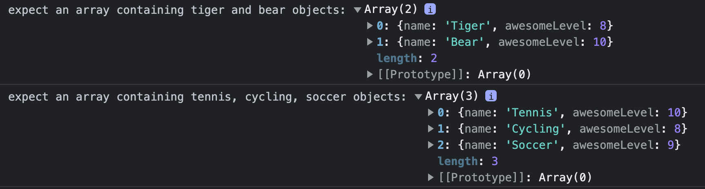

# Writing Code to Solve a Problem

**Instructor Notes**

- No starter repo for this.
- In the repo named `${cohortName}-js-foundations`, create and source:
  - `writingCode.js`
- Here's an example of what the finished JS file ends up looking like:
- <details>
  <summary>Finished Lecture Code</summary>

  ```js
  let animals = [
    {
      name: 'Whale',
      awesomeLevel: 6
    },
    {
      name: 'Penguin',
      awesomeLevel: 7
    },
    {
      name: 'Gerbil',
      awesomeLevel: 7
    },
    {
      name: 'Tiger',
      awesomeLevel: 8
    },
    {
      name: 'Dragon',
      awesomeLevel: 2 // 👈 kinda dangerous...
    },
    {
      name: 'Bear',
      awesomeLevel: 10
    },
  ];

  let sports = [
    {
      name: 'Tennis',
      awesomeLevel: 10
    },
    {
      name: 'Archery',
      awesomeLevel: 5
    },
    {
      name: 'Basketball',
      awesomeLevel: 7
    },
    {
      name: 'Cycling',
      awesomeLevel: 8
    },
    {
      name: 'Soccer',
      awesomeLevel: 9
    },
    {
      name: 'Disc Golf',
      awesomeLevel: 6
    },
  ];
      

  // INPUT:
    // array of objects, where each object has
    // a name and awesomeLevel property
  // OUTPUT:
    // an array containing zero or more objects whose
    // awesomeLevel property was higher than 7.
  function filterOutNonAwesome(items) {
    // Make an empty array that we'll put the awesome items
    // we find into:
    let awesomeItems = [];

    // Loop through the items array:
    for (let item of items) {
      // If the item I am looking at has an awesomeLevel above 7:
      if (item.awesomeLevel > 7) { // 👈 item.awesomeLevel > 7 is an expression!
        // Stuff the item into the awesomeItems array:
        awesomeItems.push(item);
      }
    }

    // Return our array that now contains any awesome items
    // that we found:
    return awesomeItems;
  }


  console.log('expect an array containing tiger and bear objects:', filterOutNonAwesome(animals));
  console.log('expect an array containing tennis, cycling, soccer objects:', filterOutNonAwesome(sports));

  ```
  </details>

**Concepts**

- Design a data structure that models a "box of things."
- Learn to use human language to create an algorithm.
- Translate human language into pseudocode.
- Use control flow--*loops and conditionals*--to implement an algorithm.

---

## Make a Robot That'll Get the Awesome Things

#### The Problem to Solve:

Imagine you have two boxes:
- Each box is filled with items. 
- Each item has its own `name` and `awesomeLevel`.
  - `awesomeLevel` is a number `0` through `10`.

Imagine that someone asks you to make a robot that can look through these boxes in order to obtain all of items that have an `awesomeLevel` above `7`.

What we are really being asked is to create an **algorithm** for the robot to follow.

#### Design a Data Structure:

If we're going to write code that deals with boxes of items, we need to know how this data will be *modeled*.
- A "box filled with items" sounds like an array:
  - `[item, item, item, ...]`
- An "item that has its own `name` and `awesomeLevel` sounds like an object:
  - `{name: 'ball', awesomeLevel: 4}`

A big part of software development is choosing sensible data structures that model our data. So, in this case, let's go with an *array of objects* to represent a "box filled with items."

It's good to have dummy data to work with. Let's model a box of animals:
* <details>
  <summary>animals array</summary>

  ```js
  let animals = [
    {
      name: 'Whale',
      awesomeLevel: 6
    },
    {
      name: 'Penguin',
      awesomeLevel: 7
    },
    {
      name: 'Gerbil',
      awesomeLevel: 7
    },
    {
      name: 'Tiger',
      awesomeLevel: 8
    },
    {
      name: 'Dragon',
      awesomeLevel: 2 // 👈 kinda dangerous...
    },
    {
      name: 'Bear',
      awesomeLevel: 10
    },
  ];
  ```
  </details>

Our code will be a bit more trustworthy if we have more than one box to test it on, let's make another. Let's model a box of sports:
* <details>
  <summary>sports array</summary>

  ```js
  let sports = [
    {
      name: 'Tennis',
      awesomeLevel: 10
    },
    {
      name: 'Archery',
      awesomeLevel: 5
    },
    {
      name: 'Basketball',
      awesomeLevel: 7
    },
    {
      name: 'Cycling',
      awesomeLevel: 7
    },
    {
      name: 'Soccer',
      awesomeLevel: 9
    },
    {
      name: 'Disc Golf',
      awesomeLevel: 6
    },
  ];
  ```
  </details>

This was a crucial step! In fact, when you begin working on your solo project in 7-ish weeks, one of the very first planning steps you'll take is thinking through how you'll model your application data.

#### Create an Algorithm:

Now forget the robot for a second. How would you, the human (to the best of our knowledge), solve this problem?

Here's one human's opinion, formatted as a step-by-step process:
1. Get one of those item-filled boxes.
2. Look at each item in the box.
3. When an item has an `awesomeLevel` higher than `7`, put it off to the side for later.
4. After I've looked at each item, I should have a pile of items whose `awesomeLevel`s are above `7`.
5. I did it. The pile is the solution!

No joke, that 👆 is an algorithm. We have solved this problem. **All an algorithm is is a set of rules to be followed.**

#### Translate our Algorithm Into Pseudocode:

Now that we have a solution, let's think about how we'd need to communicate it to the robot. Robots need very explicit directions, AKA: code.

What is pseudocode? It's not the human-language algorithm we just came up with. It's also not code. Think of it as a magical middle ground that exists between human language and code.

Let's translate our human-language solution into pseudocode! You'll soon find see how this will help us write a JS function that our hypothetical robot could run:


```js
// Here's some pseudocode! Isn't it lovely?
// * Make a function that takes in a box of items as an argument,
//   then, inside the function:
//    * Declare a variable:
//        * Name it awesomeItems
//        * Assign it a value of empty array
//    * Loop through the box of items we received as an argument:
//        * If the item I am looking at has an awesomeLevel above 7:
//            * Stuff the item into the awesomeItems array
//        * Else:
//            * Don't do anything, I guess
//    * Now that the loop is over, we need to return the awesomeItems
//      array, which should be filled with items whose awesomeLevel is > 7.
```

---

## Putting it All Together

Quick recap. So far, we have:
1. Designed a data structure to model the "box of items" that our problem specifies.
2. Talked through a potential algorithm that could solve the problem.
3. Converted the human-language algorithm to pseudocode that shows the process we need our function to execute.

Now we need to convert our pseudocode to JS. Remember that every line of code we write is an *untested assumption*. Let's be sure we verify that each small part of our code is behaving how we expect *as we are building our solution*. This limits the surface area of bugs:
* Imagine writing 50 lines of code. The code doesn't work. Congrats, you have 50 lines of code to debug.
* Imagine writing 5 lines of code. The code doesn't work. Congrats, you have 5 lines of code to debug. **Better, yes?**

Let's write code now. 🙌 What's the *first, smallest step we can take*?

#### Declare a Function:

We've already thought through the behavior of this function. Here's a neat trick, though. Let's document the input/output we expect for this function:
```js
// INPUT:
  // array of objects, where each object has
  // a name and awesomeLevel property
// OUTPUT:
  // an array containing zero or more objects whose
  // awesomeLevel property was higher than 7.
```

Naming our function is a big opportunity to make this code easily understandable. Functions perform actions, so we name them with **verbs**. This function will take in an array of items, then return a new array that has filtered out the "non-awesome" items (based on their `awesomeLevel` values). Let's communicate that with the name of the function:
```js
// INPUT:
  // array of objects, where each object has
  // a name and awesomeLevel property
// OUTPUT:
  // an array containing zero or more objects whose
  // awesomeLevel property was higher than 7.
function filterOutNonAwesome() {

}
```

We've already identified this function will expect to receive an array of objects as an argument. This is another chance to improve our code's readability! What's a good label to slap on this chunk of data that our function expects to receive? How about `items`? Check it out: Now our function *and* its parameter read like human language!
```js
// INPUT:
  // array of objects, where each object has
  // a name and awesomeLevel property
// OUTPUT:
  // an array containing zero or more objects whose
  // awesomeLevel property was higher than 7.
function filterOutNonAwesome(items) {

}
```

There's another small step we could take, here! Look at our pseudocode again. There are essentially three things our algorithm does inside the function:
1. Make an empty array named `awesomeItems`.
2. Loop through `items`, put the awesome ones into `awesomeItems`.
3. Return `awesomeItems`.

The "work" we're going to do here really all takes place in step 2. Since that's the case, we might as well implement steps 1 and 3.
```js
// INPUT:
  // array of objects, where each object has
  // a name and awesomeLevel property
// OUTPUT:
  // an array containing zero or more objects whose
  // awesomeLevel property was higher than 7.
function filterOutNonAwesome(items) {
  // Make an empty array that we'll put the awesome items
  // we find into:
  let awesomeItems = [];

  // Return our array that now contains any awesome items
  // that we found:
  return awesomeItems;
}
```

#### Document Our Expectations of How the Function Should Behave:

Next, let's use `console.log` statements to document our expectations of how this function should ultimately behave. Think of these as *tests* that our function needs to pass. Let's add 'em to the bottom of our file:
```js
console.log('expect an array containing tiger and bear objects:', filterOutNonAwesome(animals));
console.log('expect an array containing tennis, cycling, soccer objects:', filterOutNonAwesome(sports));
```

Alright! We've written some code! Let's run it in order to verify that we haven't already introduced a bug into our code by making a typo. Before we run it, we need to have a clear idea of what *we expect our code to do*. In this case, we expect two `console.log` statements to appear in our browser console. In each of these, we expect our function to return an empty array. Like:
```
expect an array containing tiger and bear: []
expect an array containing tennis, cycling, soccer: []
```

Groovy! Now we're at a place where we trust the code we've written so far. It's a happy place to be.

And now, we only have one bit of pseudocode that we haven't yet translated into JS:
```
//    * Loop through the box of items we received as an argument:
//        * If the item I am looking at has an awesomeLevel above 7:
//            * Stuff the item into the awesomeItems array
//        * Else:
//            * Don't do anything, I guess
```

What's the next smallest/testable step we can take? We need to loop through the "box of items" (an array of objects) that our function receives as an argument.

#### Implement the Loop:
Let's do it! But how can we verify that our loop works? The most straightforward thing would probably be to put a `console.log` inside the loop to verify that we're indeed accessing each item:
```js
// INPUT:
  // array of objects, where each object has
  // a name and awesomeLevel property
// OUTPUT:
  // an array containing zero or more objects whose
  // awesomeLevel property was higher than 7.
function filterOutNonAwesome(items) {
  // Make an empty array that we'll put the awesome items
  // we find into:
  let awesomeItems = [];

  // Loop through the items array:
  for (let item of items) {
    console.log('item is:', item);
  }

  // Return our array that now contains any awesome items
  // that we found:
  return awesomeItems;
}
```

What do we expect to see in the browser console now? We should see a `console.log` statement that looks something like this for each of the items we encounter in the loop:
```
item is: { name: 'Whale', awesomeLevel: 6 }
```
And, we should still see our original `console.log`s, which each look something like:
```
expect an array containing tiger and bear objects: []
```

Woo! Let's implement the last piece of logic that our pseudocode specifies.

#### Implement the "Is it Awesome?" Check:
Let's finish this off! Now that we know all of our code is doing what we expect, we need to **conditionally take action** within each iteration of our loop. Here's the pseudocode we wrote for this:
```
//        * If the item I am looking at has an awesomeLevel above 7:
//            * Stuff the item into the awesomeItems array
//        * Else:
//            * Don't do anything, I guess
```

So, let's harness the power of the computer's ability to quickly evaluate expressions! Check it out, let's even repurpose our pseudocode to be a comment!
```js
// If the item I am looking at has an awesomeLevel above 7:
if (item.awesomeLevel > 7) { // 👈 item.awesomeLevel > 7 is an expression!
  // Stuff the item into the awesomeItems array
  awesomeItems.push(item);
} else {
  // Don't do anything, I guess
}
```

When the expression `item.awesomeLevel > 7` evaluates to a value of `true`, the code inside the `if` statement's block will execute. *Our algorithm will conditionally take action!* 💪🧠

This looks good! But, if there's no additional action we need to take inside the `else`, we might as well just delete it. (Pseudocode isn't always perfect, and that's ok!)

Let's put this code into our function.
```js
// INPUT:
  // array of objects, where each object has
  // a name and awesomeLevel property
// OUTPUT:
  // an array containing zero or more objects whose
  // awesomeLevel property was higher than 7.
function filterOutNonAwesome(items) {
  // Make an empty array that we'll put the awesome items
  // we find into:
  let awesomeItems = [];

  // Loop through the items array:
  for (let item of items) {
    // If the item I am looking at has an awesomeLevel above 7:
    if (item.awesomeLevel > 7) { // 👈 item.awesomeLevel > 7 is an expression!
      // Stuff the item into the awesomeItems array:
      awesomeItems.push(item);
    }
  }

  // Return our array that now contains any awesome items
  // that we found:
  return awesomeItems;
}
```

Now, our `console.log` statements should look something like:


🎉 We did it. This is literally all that software development is. It's just that the problems we solve become more complex, and the algorithms often require many more steps. But, the process is *always the same*. If you can do this 👆, you can basically do anything.
