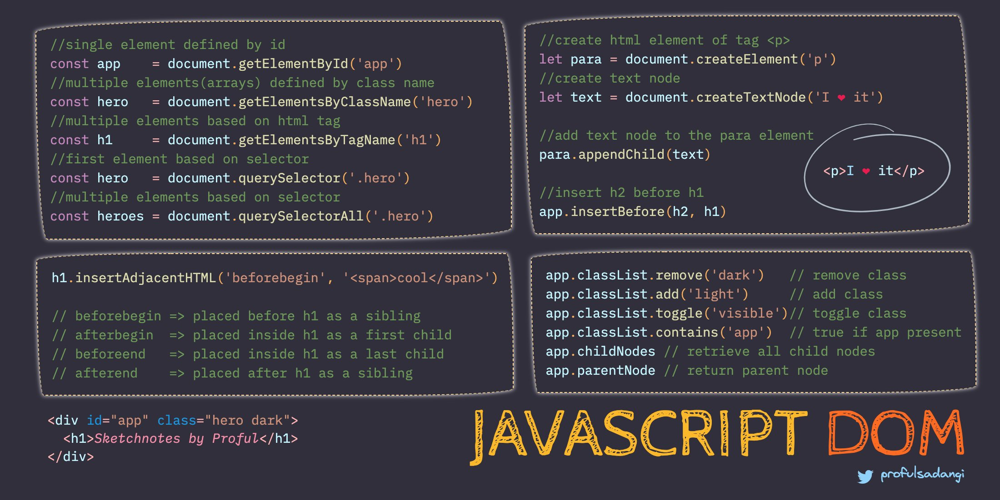
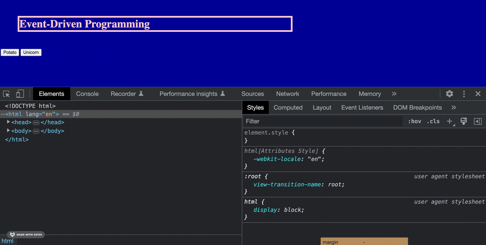

# Event-Driven Programming

**Instructor Notes**
- Starter repo:
  - https://github.com/PrimeAcademy/event-driven-programming-starter
- This lecture is really two things:
  1. Getting to a shared understanding of the why/what of how to use JavaScript to manipulate the DOM.
  2. Making a button that appends a potato to the DOM.
- Immediately after the lecture:
  1. Push the repo with completed code up to GitHub.
  2. Instruct students to fork/clone and make the 🦄 button work.

**Conceptual Goals**
- Grok the need for `defer`, when sourcing JavaScript
- Get comfy with the pattern of using JavaScript to:
  1. Select an element.
  2. Do stuff with the selected element.
- Attach onclick function that appends a 🥔 to the DOM.

## Understanding JavaScript DOM Manipulation

JavaScript is a powerful scripting language that enables dynamic interactivity on websites when applied to an HTML document. The key to this interactivity is JavaScript's ability to manipulate the Document Object Model (DOM), which represents the structure of an HTML document.

### What is the DOM?
The DOM is a hierarchical representation of an HTML document. It models the page so that programs can change the document structure, style, and content dynamically. Each element, attribute, and piece of text in the HTML is represented by a node in the DOM.

### Why is DOM Manipulation Important?

1. **Dynamic Content**: JavaScript allows you to change the content of an HTML element in real-time. Whether it's updating a user's score in a game, displaying real-time data, or personalizing a user's experience, DOM manipulation is at the heart of these dynamic webpages.
2. **Interactivity**: Beyond just displaying content, JavaScript enables user interactivity. Elements can be made interactable, buttons can trigger pop-ups, and forms can display immediate feedback to users, all through manipulating the DOM.
3. **Efficiency**: Instead of reloading an entire page to see a small update, only specific parts of the DOM can be changed without requiring a full page refresh. This results in quicker updates and a smoother user experience. (This is called a "Single-Page" application)
4. **Versatility**: DOM manipulation isn't limited to just changing content. It allows for adding, modifying, or deleting elements and attributes. This means the structure and style of a webpage can be dynamically altered based on conditions or user actions.

### Core JavaScript Methods for DOM Manipulation:

- **Selecting Elements**:
  - `document.getElementById('id')`: Selects an element by its ID.
  - `document.querySelector('selector')`: Selects the first element that matches the specified CSS selector.
  - `document.querySelectorAll('selector')`: Selects all elements that match the specified CSS selector.

- **Modifying Elements**:
  - `.innerText` or `.textContent`: Change the text content of an element.
  - `.innerHTML`: Change the inner HTML of an element.
  - `.setAttribute(name, value)`: Set a new value for an attribute.
  - `.classList.add()` or `.remove()` or `.toggle()`: Modify an inline CSS style of an element.

- **Adding or Removing Elements**:
  - `document.createElement('element')`: Create a new element.
  - `.appendChild(childElement)`: Add a child element to an element.
  - `.removeChild(childElement)`: Remove a child element from an element.
  - `.remove()`: Remove an element.


In conclusion, DOM manipulation using JavaScript is essential for creating dynamic and interactive web pages. It offers web developers the flexibility and power to create engaging, efficient, and responsive user experiences. As you delve deeper into web development, mastering DOM manipulation will be fundamental to creating modern web applications.


---

## The JavaScript Query Selector Function

`document.querySelector()` and `document.querySelectorAll()` 👈 These are functions!

Specifically, they are **the JavaScript DOM query selector functions**. They allow you to select HTML elements directly without the need for any libraries.

What do these functions do? They *select* HTML elements.

Let's define them in terms of input and output:
- Input: Both functions expect a CSS selector *string* as an argument.
- Output:
  - `document.querySelector()`: It returns the first HTML element that matches the CSS selector.
  - `document.querySelectorAll()`: It returns a NodeList of all HTML elements that matched the CSS selector.

---

## Let's Talk About Events Again

You already know the first two. Here are the three events that matter to us:

- **EVENT #1**: Browser receives the `index.html` file and **begins** constructing the DOM.
- **EVENT #2**: DOM construction is **finished**.
- **EVENT #3**: User events (like clicks, key presses, etc.). We'll dive deeper into this later!

For our JavaScript to effectively manipulate the DOM, we must ensure it runs *after* **EVENT #2** has occurred. Here's how we achieve this with pure JavaScript:

*(index.html)*
```html
<!DOCTYPE html>
<html lang="en">
<head>
    <meta charset="UTF-8">
    <meta name="viewport" content="width=device-width, initial-scale=1.0">
    <title>Simple Boilerplate</title>
    <!-- Including the script with defer attribute -->
    <script src="script.js" defer></script>
</head>
<body>
    <!-- Your HTML content goes here! -->
</body>
</html>
```

> **Commentary:**
> In this code, the function `onReady` serves as an initializer for our JavaScript operations on the DOM. It's set up to run as soon as the DOM is ready, thanks to the `defer` attribute in our script tag.
>
> Remember, any JavaScript operations we want to perform on the DOM must only happen **after** the DOM is fully constructed. Think of it like this: *I can't decorate my room until it's been cleaned up*. By convention, we package our primary JavaScript logic inside a function named `onReady`. (We can also execute and write code outside of onReady, but we'll save that for later.)

*(script.js)*
```js
function onReady() {
  console.log('The DOM is ready! Time for some JavaScript magic!'); // 👈 appears second
}
// The onReady function will run as soon as the DOM is fully constructed.
onReady();
```

With this setup, our JavaScript will wait for the DOM to be completely constructed before executing, ensuring all elements are accessible and ready for manipulation or interaction.

---

## Select, then Act

Once we've *selected* HTML element(s) using JavaScript, we can utilize the built-in DOM methods to *act* upon those selections. Here are some examples of valid JavaScript code:

- `document.getElementById('apple').remove();`
  - "Hey JavaScript, select the element with the id `'apple'` and remove them from the DOM."
  
- `document.getElementById('basket').textContent = '🍎🍏🍎🍏🍎🍏';`
  - "Hey JavaScript, select the HTML element with the id `'basket'` and change its text content to `'🍎🍏🍎🍏🍎🍏'`."
  
- `document.getElementById('bear').classList.add('huge-font');`
  - "Hey JavaScript, select the element with the CSS id of `'bear'` and add the CSS class `'huge-font'` to it."

**All of the stuff we will do with javascript follows this pattern:**
1. Select HTML element(s) with one of the selector functions:
   - `document.querySelector('li')`: Select an element using a basic CSS selector.
   - `document.getElementById('some-id')`: Select an element by `id`.
2. Manipulate said element

Here's an awesome [cheat sheet](https://dev.to/m0nm/javascript-dom-manipulation-cheatsheet-1jkb) that clearly displays:
- Ways of selecting HTML elements.
- Methods that can be used on manipulate elements.



---

## EVENT #3: User Events

A "user event" is an instance of a user doing a thing. What things do users do? So many things: Clicks, keystrokes, mouse moves, scroll, etc.

JavaScript gives us the power to **listen** for these events, then take some kind of action as a response.

### Event Handling

```html
<body>
  <header>
    <h1>Event-Driven Programming</h1>
  </header>

  <button>Potato</button>
  <button>Unicorn</button>

  <div>
    <!-- Yo, this is where the potatos go! -->
  </div>
</body>
```

What we need to do is make it so that whenever a user clicks the Potato button, we add a `'🥔'` to the `<div>` that's currently empty.

We can do this, and we can do it with javascript!

#### Listening for Clicks

The way event handlers work is that we *attach* an *event-listener* to an element. To listen for **click events** on the Potato button, we need to:

- Use the JavaScript selector method to select that button.
  - Selectors first begin with the `document` object, then use a method to select an element.
  - In JavaScript there are two main methods for selecting elements:
    1. `document.querySelector()`
        - Selects the first element that matches the specified CSS selector. This will return a single element.
  - For this we only want to select one element, so we'll use `document.querySelector()`.
  - We need a way to select *only* the Potato button.
  - Instead of coming up with a fancy CSS selector, the most reliable thing to do is just slap an `id` on the button we want to target.
  - ```html
    <button id="potatoButton">Potato</button>
    ```
  - Then, we can easily select that button with JavaScript code:
    - `document.querySelector('#potatoButton')`
    - `document.getElementById('potatoButton')`

      - **Translation:** "Hey JavaScript, select the element that has an `id` of `potatoButton`."
  
- Now we need to *attach a function to the element*
    2. The name of a function to run when the event takes place.
        - `makePotato`
- Before we write a *ton more code*, let's test this out. How can we know that our click-listener works? Let's create a `makePotato` function that just spits out a `console.log`.
  - ```js
    function makePotato() {
      console.log('whoa, i got clicked.');
    }
    ```
- On the button itself:
```html
  <button onclick="makePotato()">Potato</button>
```

#### Appending to the DOM

Now we trust our code up until this point! Let's solve the next problem: How do we use JavaScript to put a `'🥔'` in that `<div>`?
- In human language, we need to say:
  - "Hey JavaScript, please select that magical div and stuff a potato in it."
- In code, we want a simple way to target the `<div>`, so let's add an `id` to id:
- ```html
  <div id="magicalDiv">
    <!-- Yo, this is where the potatos and unicorns go! -->
  </div>
  ```
- So to select that `<div>` with JavaScript, we could just:
  - `const magicalDiv = document.getElementById('magicalDiv');`
    - **Translation:** "Hey JavaScript, select the element that has an `id` of `magicalDiv`.
    - We store the selected element in a variable called `magicalDiv` so that we can use it later.
- Now what? If you weren't at Prime, you'd need to use your Google skills to ask some question like `"How can I use JavaScript to add something to the DOM?"
  - But, you're at Prime, so we'll just show you the `.innerHTML` property. 🙂 Check this out:
  - ```js
    magicDiv.innerHTML += '<p>🥔</p>';
    ```
    - **Translation:** "Hey JavaScript, select the element with an `id` of `magicalDiv`, then put a potato emoji inside it."
- Now our `makePotato` function looks like this:
```js
function makePotato() {
  console.log('whoa, makePotato() got clicked.');

  // Select the magicalDiv element on the dom.
  const magicalDiv = document.getElementById('magicalDiv');
  // When the potatoButton is clicked, add a new element to the magicalDiv element.
    magicDiv.innerHTML += '<p>🥔</p>';
}
``` 
- Check out what happens when we click the button button:
  - 

---

## Your Turn

Now it's your turn to make the Unicorn button handle clicks by adding a 🦄 to the `#magicalDiv` element.
