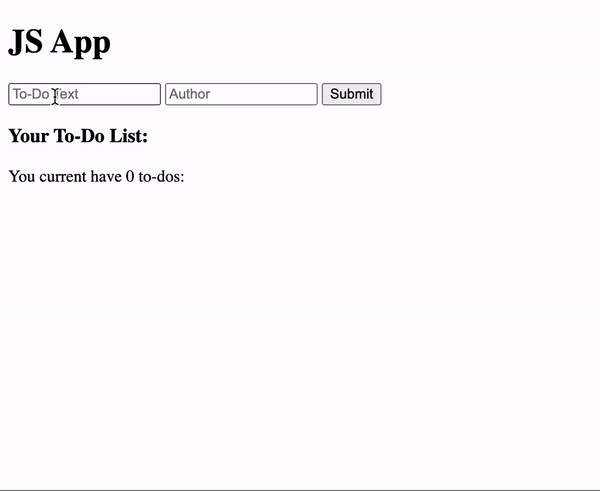

# Let's Make an App Already

**Instructor Notes**:
- Starting repo:
  - https://github.com/PrimeAcademy/js-app-starter
  - **Note:** Starter repo's README includes a handy *JavaScript Essentials* cheat sheet. 🙂
- Be sure to model *write a little code, test a little code* as you build out this app.
  - Example: The first thing your `handleSubmit` function should do is `console.log` something to prove that the click handler works as expected.

**Conceptual Goals**:
- Use `event.preventDefault()` to override an HTML `<form>`'s default behavior.
- Understand how to use `.value` and `.textContent` as getters/setters.
  - These are properties of DOM elements that can be used to access or update their content.
  - `.value` is used to access or update the content of an `<input>` element.
  - `.textContent` is used to access or update the content of a non-input element.
- Leverage JavaScript's DOM traversal methods to select an `<li>` whose child `<button>` received a click.
- Reinforce the usage of a global variable, `todoCount`, to store a piece of application state.


## Here's What We are Making



- View the "finished" code here:
  - https://github.com/PrimeAcademy/js-app-finished

---

## Concepts to Cover Along the Way

- `event`s are automatically handed as arguments to event handlers' callback functions.
- `<form>` elements have a default behavior that we must override to prevent undesired page refreshes.
- `.value` used as a getter to obtain what a user typed into an input.
- template literals being used to format multiple lines of HTML as strings to be appended to the DOM.
- `.value` used as a setter to "clear out" an input.
- `.parentElement` used to select a clicked `<button>`'s parent element.
- `.textContent` used as a setter to update the text .content of an element.

---

## Features to Implement

#### To-Do Form
- Users can type the text and author name for a new to-do.
- Users can click a submit button that:
  - Adds the new to-do item to an unordered list of to-dos.
  - Increments the to-do count.

#### To-Do List
- Users can click each to-do item's delete button, which:
  - Removes that entire to-do item from the DOM.
  - Decrements the to-do count.

---

## To-Dos for Building This App:

- Declare a global `todoCount` variable and assign it a value of `0`.

- Implement a click handler that listens for clicks on the to-do form's submit button.
  - It should call a `handleSubmit` function.

- Create a `handleSubmit` function that:
  1. Override the default behavior of a form submission.
  2. Uses `.value` as a getter to obtain the text that the user typed inside the two `<input>` elements.
  3. Use `.innerHtml` to add a to-do item to the DOM that includes the text that the user typed into each input.
    - Create an `<li>` element with a `<button>` inside of it.
  4. Use `.value` as a setter to "clear out" the text that the user typed in the two `<input>` elements.
  5. Add `1` to the `todoCount` variable.
  6. Use `.textContent` as a setter to update the todo-count text on the DOM.

- Use event management to implement a click handler that listens for clicks on to-do items' delete buttons.
  - It should call a `deleteTodo` function.

- Create a `deleteTodo` function that:
  1. Remove the `<li>` from the DOM whose delete-button received the click.
  2. Subtract `1` from the `todoCount` variable.
  3. Use `.textContent` to update the todo-count text on the DOM.
 


### DOM Traversal

Using `.parentElement` you are able to access elements that wrap around the target element. For example:

```js
function handleClick(event) {
  let parent = event.target.parentElement;
  console.log('Parent element: ', parent);
}
```

### Modifying Styles from JavaScript

Using `event.target` or `document.querySelector()` to access an element, `element.classList.add("my-class");
` can be used to add a class of the selected element. `element.classList.remove("my-class");` would remove it.


```js
function handleClick(event) {
  let parentDiv = event.target.parentElement;
  console.log('Parent element: ', parentDiv);
  parentDiv.classList.add("my-class");
}
```

## Forms

In the early days of the web, one of the few ways to make pages interactive was with a [`<form>`](https://developer.mozilla.org/en-US/docs/Web/HTML/Element/form) element.

```html
<form>
  <input id="first-name" type="text" placeholder="First Name">
  <input id="last-name" type="text" placeholder="Last Name">
</form>
```

Forms can be thought of as a collection of [`<input>`](https://developer.mozilla.org/en-US/docs/Web/HTML/Element/input) elements (which can have types of "text", "radio", "checkbox" and more). They may also contain [`<button>`](https://developer.mozilla.org/en-US/docs/Web/HTML/Element/button), [`<select>`](https://developer.mozilla.org/en-US/docs/Web/HTML/Element/select), or other HTML elements. Once the user has entered values into these elements, the whole form can be _submitted_, either by pressing enter, or by clicking on a button.

>> Fun fact, *any* button click in a form would trigger the submit. To have a button that DOESNT trigger, you have to use
`<button type="button">`

```html
<form>
  <input id="first-name" type="text" placeholder="First Name">
  <input id="last-name" type="text" placeholder="Last Name">
  <button type="submit">Submit</button>
</form>
```

In old school HTML, this would trigger a lot of default behavior. The form data would get bundled up in XML and sent off to the backend. The whole page would then get reloaded in order to display any new data the form triggered. Unfortunately, in the age of JavaScript **the default form submit behavior is almost always avoided**.

### Onsubmit

Thankfully, it is relatively easy to define our own behavior. First, we need an "onsubmit" attribute. Note that it goes _on the form_, not on the submit button.

```html
<form onSubmit="handleSubmit(event)">
  <input type="text" placeholder="First Name">
  <input type="text" placeholder="Last Name">
  <button type="submit">Submit</button>
</form>
```

Our JavaScript can then do what ever we like with the form data, but importantly, _we must call [`.preventDefault()`](https://developer.mozilla.org/en-US/docs/Web/API/Event/preventDefault) on the event_. Otherwise the whole page will be reloaded.

```js
function handleSubmit(event) {
  event.preventDefault();

  // Do something with the form data
  let firstName = document.querySelector('#first-name');
  let lastName = document.querySelector('#last-name');

  console.log('Hello', firstName, lastName);
}
```

Note that this `preventDefault` method may occasionally come up with other Event types as well. The default DOM behavior for Events is not always desirable. But its most common usage is with forms.

---
