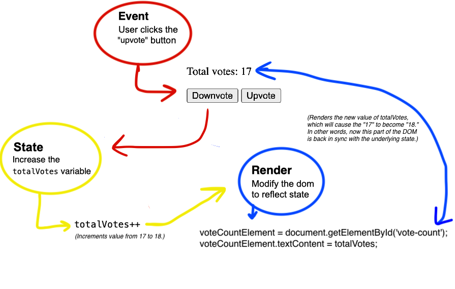

# Event, State, Render Pattern

**Starter repo:** [https://github.com/PrimeAcademy/event-state-render-starter](https://github.com/PrimeAcademy/event-state-render-starter)

**Frame it up:**
- Let's talk about at our salary calculator live solve from this morning. Right now, if we wanted to know stuff about our list of employees (like how many employees there are, or how many employees are managers), where would we look to figure that out? 
	- **Answer**: The DOM. Right now the DOM is our source of truth. When I say 'source of truth', I mean the place that we can look and say, "This is what data we have at the moment!"
	- Right now, we're not really keeping track of our list of employees anywhere in our code. When a user adds a new employee, we immediately append it to the DOM and then forget about it.
- Based on what we know so far, the DOM may be a fine source of truth. But here's the thing: Pretty soon we'll be storing data somewhere else. We want to anticipate that problem and keep track of our data somewhere besides the DOM.

To solve this problem, we're going to use a **pattern**. Here's what that pattern's going to look like:
(**Emma** draw this out a bit on the whiteboard)

- Instead of just keeping track of data on the DOM, we're going to keep track of it in our code too. 
	- In the case of our salary calculator, what could that look like? Perhaps a variable to store employees
- Then, we'll **display** our data on the DOM. Now, the DOM's not our source of truth; it's just a *reflection* of our source of truth.
- Every time a user does something to change our data, we'll update that *data* and then re-display our new data to the user.

This **pattern** is the way that many modern applications work. We're going to call this pattern **Event, State, Render.**

 > We're going to use this pattern throughout our time at Prime, because it's so common when building web applications and if you're building applications at future jobs, it's very likely you'll be using this pattern.

Let's look at how this looks in practice. 

## Events === User Interactions

**Everything that _happens_ in a web app is triggered by some user interaction:** clicking a button, typing text into a form field, moving the mouse, etc. 

In code, **we call those interactions "events".** The job of our of code is to "handle" or respond to user events:

```html
<!-- 
    Add an id to the button so we can select it
    Add an onclick attribute to the button that will call our onUpvote function
 -->
<button id="upvote-button" onclick="onUpvoteHandler()">
```

```js
function onReady() {
    // Any code in here will run when the page loads
}

function onUpvoteHandler() {
    // Event handler code goes here 👇
}

// If you had code inside of onReady, this would run it when the page loads
onReady()
```

We can put whatever kind of code we want in that event **handler** function. But often, we'll **respond to user interactions by _updating state_.**

## State === Data

When we talk about "state", we're talking about **all the properties that describe what our application currently looks like**. For this small use case, the main thing we need to know is: how many upvotes are there?

```js
// This variable holds our application state!
let totalVotes = 0;
```

In this case, the only state we need to keep track of is `totalVotes`. But state can be more complicated than just a number. State can look a lot of different ways: an array, a number, an object. At the end of the day, remember that state is the **current state of your application**, and whatever data is part of telling that full story.

When a user interacts with the app (event), we will **update the app's _state_ to reflect the user's intent:**

```js
// Any variable can be used to represent state.
// In this case our variable is just a number
let totalVotes = 0;

function onReady() {
    // Any code in here will run when the page loads
}

function onUpvoteHandler() {
    // The user's intent is to increase the total vote count
    // We will update the state (totalVotes) so it matches
    // what the user wants
    totalVotes++;
}

onReady()
```

Great! We now have data in our state variable that matches the user's intent. But there's nothing for the user to _see_ yet. For that, we need our final step: We need to **bring the DOM back in sync with our state**. How do we do this? We **rerender** the part of the DOM that's responsible for showing the current state of the data.

## Render === Updating the DOM

The last step of this process is to present our state data in a way that users can see. In web development, that means _rendering to the DOM_.

> NOTE: **we use the word "render" in software to mean taking raw data and converting it something visible to users.** In web development, that will always involve HTML and DOM manipulation.

```js
// Handle upvote event
function onUpvotHandler() {
    // Update state
    totalVotes++;

    // Here, we're changing the text content of the <span id="vote-count">
    // element to show the newest value of totalVotes
    document.getElementById('vote-count').textContent = totalVotes;
}
```

### A separate `render()` function

What if we want to handle downvotes, too:

```html
<button id="upvote-button" onclick="onUpvoteHandler()">
<!-- Add a downvote button -->
<button id="downvote-button" onclick="onDownvoteHandler()">
```

```js
// Handle upvote events
function onUpvoteHandler() {
    // Update state: increase vote count
    totalVotes++;

    // Render to the DOM
    document.getElementById('vote-count').textContent = totalVotes;
}

// Handle downvote events
function onDownvoteHandler() {
    // Update state: decrease vote count
    totalVotes--;

    // Render to the DOM
    document.getElementById('vote-count').textContent = totalVotes;
}
```

Notice how there's duplicate logic for rendering in our event handlers? Let's pull that out into it's own function:

```js
// Handle upvote event
function onUpvoteHandler() {
    // Update state: increase vote count
    totalVotes++;

    // Render to the DOM
    render();
}

// Handle downvote event
function onDownvoteHandler() {
    // Update state: decrease vote count
    totalVotes--;

    // Render to the DOM
    render();
}

function render() {
    voteCountElement = document.getElementById('vote-count');
    voteCountElement.textContent = totalVotes;
}
```

You can see that each event handler follows the pattern of Event -> State -> Render: 

1. Handle a **user interaction (event)**
2. Update the **state** to match the user's intent
3. **Render** the latest value of state to the DOM

This keeps our code cleaner. It also allows us to think about these operations in isolation: the job of the event handler is simply to update state. The job of the `render()` function to update our DOM to match whatever the current state is.

Going forward, **all of your JavaScript code will follow a similar pattern**:


```js
// Create a state variable here:
let state = ....;       // state can be anything!

function onReady() {
    // onReady is useful for setting up your app by running any initial code automatically
}

onReady()

// Handler Functions, Event Listeners, etc
function oneEventHandler() {
    // Update state...

    // Render your updated state
    render();
}

function anotherEventHandler() {
    // Update state...

    // Render your updated state
    render();
}

// The render function updates the DOM, 
// using the data in our state variable
function render() {
    // Use JavaScript Dom functions & properties to modify the DOM
}
```

Of course there will be variations on this theme and new tech to plug in (servers and databases!), but the basic structure of your apps will largely stay the same.

## Diagram of what we've accomplished so far:

*Instructor Note*: Draw this out!




## Render when the page loads

This week, we'll be storing our state on the server. Right now, every time we refresh the browser, we start from scratch. If we refresh this upvote/downvote app, our `voteCount` variable will start back at `0`.

The server is a "more permanent" place to store data. Instead of a hardcoded `0` as the starting value for `voteCount`, we're going to be asking our server *what the current value of `voteCount` is,* then rendering the DOM based on that. Instead of hardcoding a `0` in our HTML and file, we can call our render function *when the page loads*:

```html
<!-- Remove the hardcoded 0 from the vote-count span: -->
  <p id="total-votes">
    Total votes:
    <span id="vote-count"></span>
  </p>
```

```js
// votes.js

// This will run when the page loads to get the initial vote count and render it to the DOM

totalVotes = 0;

function onReady() {

    // Call our render function in when the page loads
    render();
}

function render() {
    voteCountElement = document.getElementById('vote-count');
    voteCountElement.textContent = totalVotes;
}
```

👉🏽 Eventually our front-end logic will follow a pattern coser to this, once we get the server-side state working:

```js
// Votes.js

function onReady() {

    const totalVotes = getVotes();

    // Call our render function in when the page loads
    render(totalVotes);
}

onReady()

/** 
 - Handlers will eventually communicate to the server to update state whe buttons are clicked.

 -  When handlers update server-side state they will 
**/

function getVotes() {
    // Communicate with server to GET the latest vote count
    // and return it

    return total
}

function upVoteHandler() {
    // Communicate with server to POST increase vote
    postVote("up");

    // GET the latest vote count from the server (totalVotes)
    const totalVotes = getVotes();

    // Render to the DOM
    render(totalVotes);
}

function downVoteHandler() {
    // Communicate with server to POST decrease vote
    postVote("down");

    // GET the latest vote count from the server (totalVotes)
    const totalVotes = getVotes();

    // Render to the DOM
    render(totalVotes);
}


function render(totalVotes) {
    voteCountElement = document.getElementById('vote-count');
    voteCountElement.textContent = totalVotes;
}

```

## More fun with render()

Often, our `render()` properties/function will use `.textContent`, `.createElement()` `.append()`, or `.innerHtml()` to modify the DOM. But it can do more. So much more!

Let's say we want to re-style the `#votes` div if there are more than 50 votes:

```js
function render() {
    let voteCountElement = document.getElementById('vote-count')

    voteCountElement.textContent = totalVotes;

    // We can do more than just generate HTML!
    if (totalVotes > 50) {
        voteCountElement.classList.add('lots-of-votes');
    }
    else {
        voteCountElement.classList.remove('lots-of-votes');
    }
}
```

```css
.lots-of-votes {
    border: 3px solid red;
    font-weight: bold;
}
```

---

## Complex state

Let's look at one more example with more complex state. (Open up `posts.html`)

Final code in `posts.js` should look something like:

```html
<form>
    ...
    <button id="submit-button" onClick="onSubmitPost(event)">Submit</button>
    ...
</form>
```

```js
// Keep track of state!
// posts is an array because there will be multiple posts
let posts = [];

function onReady() {
    render();
}

// Event handler
function onSubmitPost(event) {
    event.preventDefault()
    // Update state....

    // First get what the user posted
    contentInput = document.getElementById('content-input');
    authorInput = document.getElementById('author-input');

    // Then we store that in state
    const newMessage = {
        content: contentInput.value,
        author: authorInput.value
    }

    posts.push(newMessage);

    // Clear the inputs
    contentInput.value = '';
    authorInput.value = '';

    // Render
    render();
}

function render() {
    // empty the posts table
    postTableBody = document.getElementById('posts-table-body');
    postTableBody.innerHTML = '';

    // loop through the posts array 
    // and append each post to the table
    for (post of posts) {

        postTableBody.append(`
            <tr>
                <td>${post.content}</td>
                <td>${post.author}</td>
            </tr>
        `)
    }
}
```


