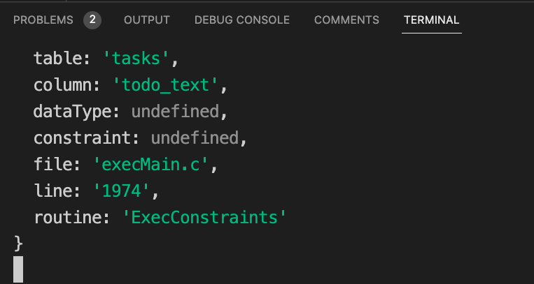
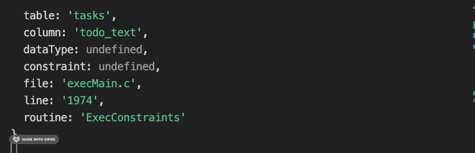
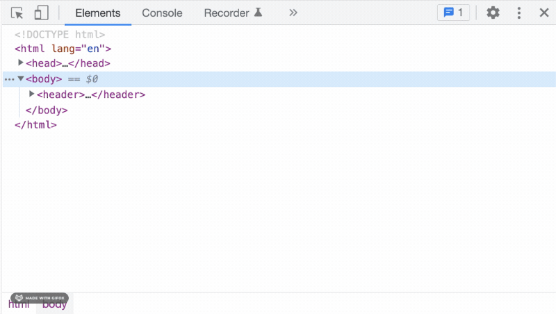
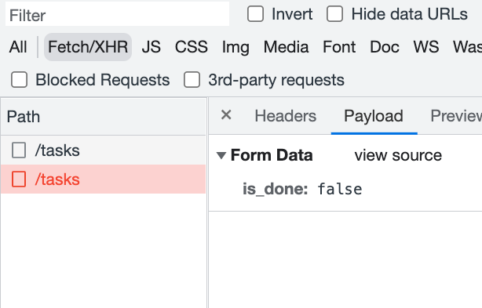
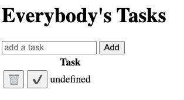

# Troubleshooting Revisited

**Starter Repo:** [Troubleshooting Starter](https://github.com/PrimeAcademy/troubleshooting-starter)

## Objectives

- Reinforce the [**_Describe / Isolate / Fix_ paradigm**](../week-06-js-dom/06-03b_troubleshooting.md) for troubleshooting
- Introduce strategies for **troubleshooting errors across the full stack**
- **Review debugging tools**, in the context of full-stack troubleshooting (console logs, Postman, Postico)
- Introduce the the **Chrome Network Panel**, as a tool for debugging AJAX requests
- Introduce the **Chrome Debugger**, as a tool for debugging client-side code

## Describe / Isolate / Fix

Remember:

1. **Describe**
   > What do you want to happen? What is actually happening?
2. **Isolate**
   > Where exactly is the problem happening?
3. **Fix**
   > Change **one thing**, and test your changes.

## Debugging the Full Stack

With the server and database added to our stack, we have many new types of possible errors. It's important to ask yourself:

> **Where in the stack is my error?**

- Client side
- Server side
- Database
- Somewhere in between (eg. Axios)

In other words, **isolate** your error in the stack.

We have tools to help us isolate our errors:

- Chrome Network Panel
- Postman
- Postico
- Debugger

Using these tools may feel like extra work at first. But investing in these tools will pay off big in the long run! You spend _most_ of your time as a developer debugging code: building this skill will make you a more productive engineer.

## Demo: A Buggy Todo App 🐛 ✅

Setup the starter repo:

- Fork and clone: [Troubleshooting Starter](https://github.com/PrimeAcademy/troubleshooting-starter)
- Setup the database, called `troubleshooting-starter-db`, using the `database.sql` file
- `npm install`
- `npm start`
- Open `http://localhost:5001`

## HTTP Errors

An **HTTP Error** is a message from our express server that something went wrong.

Every HTTP Error has a **status code**, which indicates what happened. In error responses, we'll mostly see two status codes:

- 404: Not Found
- 500: Internal Server Error

## 404 Errors

When we try to add a task, we see an error like:

> POST [localhost:5001/task](http://localhost:5001/task) 404 (Not Found)

This is our server telling us that there is not a matching _endpoint_ for `POST /task`. In other words, our request URL+method does not match a URL+method on the server:

```javascript
// client.js
// Send a request to POST /task
axios({
  method: 'POST',
  url: '/task',
  data: { newTask },
});
```

```javascript
// server.js
app.use('/tasks', tasksRouter)

// tasks.router.js
// Listen for requests to POST /tasks
router.post('/', (req, res) => {
  console.log(`This is your req.body: ${req.body}`)
})
```

Our server is listening for `POST /tasks`, but we are sending a request to `POST /task`.

Let's fix this on the client:

```javascript
axios({
  method: 'POST',
  url: '/tasks', // ❗ add a "s"
  data: { newTask },
});
```

## 500 Errors

Now we when add an task, we get a new error:

> POST [localhost:5001/tasks](http://localhost:5001/tasks) 500 (Internal Server Error)

**If you see 500 error, _ALWAYS_ look at your server logs!**

Your server logs are in your terminal (ie. where you ran `npm start`).

You may see something like:



That's not super useful 😕. You need to **scroll up** to see the beginning of the error message!



The actual error message is:

> POST /tasks query error: error: null value in column "todo_text" of relation "tasks" violates not-null constraint

This is an error from our PostgreSQL database.

## Database Errors

To _isolate_ this error we need to know:

> Is this an error with our SQL, or with our server side code?

We can use Postico to help us here. Copy paste the SQL code into Postico, replacing `$1` with an actual string:

```sql
INSERT INTO tasks
  (todo_text)
VALUES
  ('fix a bug');
```

No errors in Postico! So we now know that our SQL is valid. The error must live somewhere else.

## Testing the Server

[See instructions for using Postman](../week-08-fullstack-sql/../week-08-node-express-ajax/08-03c_postman.md)

Make a request to `POST /task`, with this data:

```javascript
{
  'task_text': 'Fix a bug',
  'is_done': false
}
```

This seems to work. The bug must lie elsewhere.

## "In-Between" Errors

Sometimes our client code is correct, our server code is correct, our SQL code is correct, but we still have bugs. The problems lies in between, in the network requests between the different systems (eg. Axios).

Chrome has a _Network Panel_ which can help us debug Axios requests:



Try adding another task: you should see a new request to `POST /tasks` in your network panel. Then select the **payload** tab:



This tells us that we are sending `{ is_done: false }` to the server. We are missing our `todo_text` data! So something is wrong with our Axios request:

```javascript
// Get the input element off the DOM:
let taskInputElement = document.getElementById('taskInput');

// Extract the value of the input element:
const newTask = taskInputElement.value;

// Log the `newTask` variable, to see what's up
console.log('newTask', newTask);

// Are we using the right jquery selector?
console.log(`taskInputElement`, taskInputElement);

axios({
  method: 'POST',
  url: '/tasks',
  data: {
    todo_text: newTask,
    is_done: false,
  },
});
```

We have a bad selector! It should be:

```javascript
let taskInputElement = document.getElementById('task-input');
```

### Rendering errors

One last bug: The task is showing up as `undefined` on the DOM:



This is a rendering error, lets look at the render function:

```javascript
function renderTasks(taskList) {

  // Grab the table body element from the DOM:
  let tbodyElement = document.getElementById('the-tasks');

  // Empty the table body:
  tbodyElement.innerHTML = '';

  // Loop through the array of task objects:
  for (let task of taskList) {
    // Add a new <tr> for each task into the table body:
    tbodyElement.innerHTML += `
    <tr data-id="${task.id}" class="${task.is_done ? 'complete' : ''}">
        <td>
          <button class="delete-button" onclick="deleteTask(event)">🗑</button>
        </td>
        <td>
          <button class="complete-button" onclick="completeTask(event)">✔️</button>
        </td>
        <td>
          ${task.todoText}   <!-- 👈 why is this undefined -->
        </td>
    </tr>
    `;
  }
}
```

What's going on here? If we could only _pause_ the script and see what's going on...

## The Debugger

See [notes for using the Chrome Debugger](./debugger.md)

- Put a breakpoint inside the `for` loop.
- Use the debugger to step through the loop for each task: see how this bit of code runs multiple times!
- See the local `task` variable, and look closely at its properties.

Does `task` object have a property called `todoText`? Look at the actual properties of the `task` variable. It has a `todo_text` property, not `todoText`.

```javascript
        <td>
          ${task.todoText}
        </td>
```

## Take Away's

- HTTP Errors
  - 404 errors: Mismatched URL or method
  - 500 errors: Look at your server logs!
- Use tools to isolate error
  - Network panel
  - Postman
  - Postico
  - Debugger

See [Debugging Tools](./debugging-tools.md) for a review of all the tools covered here.
