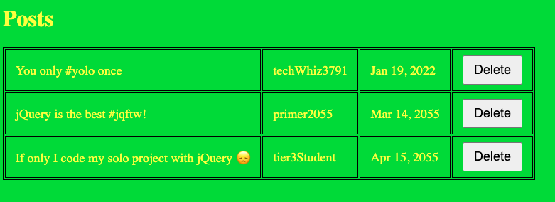
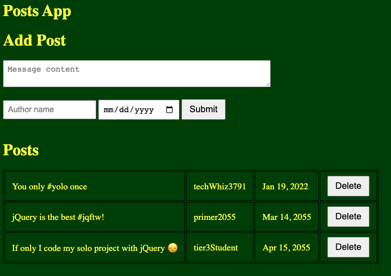

# Web Accessibility

## Objectives

- Introduce the **concept of web accessibility**
- Understand **why accessibility is important**
  - Screen readers
  - Physical impairments (vision, keyboard/mouse usage, etc)
  - Legal requirements (ADA)
- Learn about some of the **primary accessibility concerns**, and how to address them in code
  - Color Contrast
  - Semantic HTML

## Overview

As a front-end engineer, you have an ethical and legal responsibility to make your web apps _accessible_. This means that your website are equally usable by _all_ users, including those with varying auditory, visual, physical, or cognitive abilities.

For example, some users may:

- ...use a [screen reader](https://www.afb.org/blindness-and-low-vision/using-technology/assistive-technology-products/screen-readers) to access a website's content (as opposed to a monitor)
- ...be unable to see contrasting colors as well as you can
- ...use a keyboard exclusively, instead of a mouse

For the most part, browsers do a good job at making websites accessible to all users -- as long as you follow accessibility best practices!

## Color Contrast

In general, light text on a light background is very difficult to read.

Use the [Color Contrast Checker](https://webaim.org/resources/contrastchecker/) from WebAIM to make sure your text is readable at different font sizes.

**❌ Bad Example: Light text on a light background**



**✅ OK Example: Light text on a dark background**




## Semantic HTML

"Semantic HTML" means that your HTML elements help describe the meaning of their content.

For example:

```html
<div>Buy Items<div>
```

vs.

```html
<button type="submit">Buy Items<button>
```

While you can technically attach a `click` event handler to a `<div>`, it is much more clear in the second example that the `<button>` is submitting a form, to buy some items.

Or another example:

```html
<div>Todo List</div>
<p>Mow the lawn</p>
<p>Water the grass</p>
<p>Pull weeds</p>
```

While this might look ok on the screen, it would not be clear to a screen reader that this is a _list_, with a title of "Todo List".

More semantically:

```html
<h1>Todo List</h1>
<ul>
    <li>Mow the lawn</li>
    <li>Water the grass</li>
    <li>Pull weeds</p>
</ul>
```

### Semantic Forms

When creating forms:
- Use the `<form>` element
- Use the proper `type` attributes
- Use `<label>` elements, with a `for=` attribute

This will help screen readers parse your form:

```html
<form>
    <!-- Content -->
    <label for="contentInput">
        Message content
    </label>
    <textarea id="contentInput"></textarea>

    <!-- Author -->
    <label for="authorInput">
        Author
    </label>
    <input
        id="authorInput"
        type="text"
    />

    <!-- Date -->
    <label for="dateInput">
        Date
    </label>
    <input
        id="dateInput"
        type="date"
    />

    <button type="submit">Submit</button>
</form>
```

### Using forms with jQuery

The `<form>` element may be new to you. Forms differ from buttons, in that there is a `submit` event:

```js
function onReady() {
    $('form').on('submit', onSubmit);
}
```

And the event handler function must call `evt.preventDefault()`. If you forgot this, your page will reload on submit!

```js
function onSubmit(evt) {
    evt.preventDefault();
}
```

### Semantic Images

Screen readers cannot parse images. Use a `alt=` attribute to tell the screen reader about the content of the image.

```html

```

### Other Semantic Elements

Do you really need to use a `<div>`? Or is there a more descriptive element available?


See [W3Schools: Semantic Elements](https://www.w3schools.com/html/html5_semantic_elements.asp)