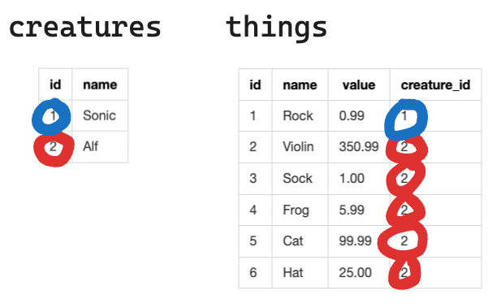
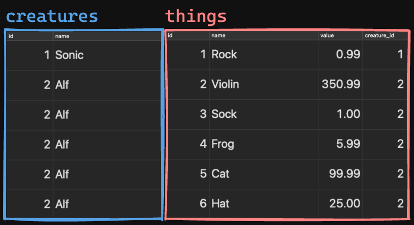

# Relational SQL: Part One

SQL is a **Relational Database**. So far, our databases have used one table. However, in the world of web development, an app's database will pretty much **always** have multiple tables that relate to each other in some way.

<details>

  <summary>Finished Lecture Code</summary>

  ```sql
  DROP TABLE IF EXISTS "things";
  DROP TABLE IF EXISTS "creatures";


  CREATE TABLE "creatures" (
    "id" SERIAL PRIMARY KEY,
    "name" VARCHAR(100) NOT NULL
  );

  CREATE TABLE "things" (
    "id" SERIAL PRIMARY KEY,
    "name" VARCHAR(100) NOT NULL,
    "value" NUMERIC(10, 2) NOT NULL,
    "creature_id" INTEGER REFERENCES "creatures" ON DELETE CASCADE
  );


  INSERT INTO "creatures"
    ("name")
    VALUES
    ('Sonic'),
    ('Alf'),
    ('Moomin'); -- 👈 Let's add a third creature that
                --    doesn't own any things.

  INSERT INTO 
    "things"
    ("name", "value", "creature_id")
    VALUES
    ('Rock', 0.99, 1),
    ('Violin', 350.99, 2),
    ('Sock', 1.00, 2),
    ('Frog', 5.99, 2),
    ('Cat', 99.99, 2),
    ('Hat', 25.00, 2);
    
      
  SELECT * FROM "creatures"
    JOIN "things"
      ON "creatures"."id" = "things"."creature_id";
      
  SELECT * FROM "creatures"
    JOIN "things"
      ON "creatures"."id" = "things"."creature_id"
    WHERE "creatures"."id" = 2
    ORDER BY "things"."value" DESC
    LIMIT 3;
  ```
</details>

## We Shouldn't Use a Single Table to Model Relational Data!

### The Data We Need to Model

If we're going to start working with multiple tables that relate to one another, we first need to understand **why using a single table is problematic**. Imagine this scenario:

We have two **creatures**. Each creature owns some **things**. Each thing has a monetary value.

1. Sonic
    * Rock - $0.99
2. Alf
    * Violin - $350.99
    * Sock - $1.00
    * Frog - $5.99
    * Cat - $99.99
    * Hat - $25.00

Here are **three really bad ways** we could model this data within a single database table:

### Bad Way #1: Column Infinity

| id | name | thing1 | value1 | thing2 | value2 | thing3 | value3 | thing4 | value4 | thing5 | value5 |
|----|------|--------|--------|--------|--------|--------|--------|--------|--------|--------|--------|
| 1  | Sonic| Rock   | 0.99   | NULL   | NULL   | NULL   | NULL   | NULL   | NULL   | NULL   | NULL   |
| 2  | Alf  | Violin | 350.99 | Sock   | 1.00   | Frog   | 5.99   | Cat    | 99.99  | Hat    | 25.00   |


The actual term for this anti-pattern is:
* *Entity-Attribute-Value (EAV)*

It's bad, because:
* It's hard to work with!
    * How would you write a query that tells you "how many things" each creature has?
* It's hard to scale!
    * How would you write a query that'd allow Alf to have a sixth thing?

### Bad Way #2: Duplicate Row Infinity

| id  | name  | thing  | value  |
| --- | ----- | ------ | ------ |
| 1   | Sonic | Rock   | 0.99   |
| 2   | Alf   | Violin | 350.99 |
| 3   | Alf   | Sock   | 1.00   |
| 4   | Alf   | Frog   | 5.99   |
| 4   | Alf   | Cat    | 99.99  |
| 4   | Alf   | Hat    | 25.00  |


The actual terms for this anti-pattern are:
* *Repeated Fields*
* *Data Duplication*

It's bad, because:
* Duplicated data wastes space!
    * Do we need to store the string `'Alf'` five times?
* It's inefficient to work with!
    * Imagine if Alf changed their name. That's **five** rows within this table that we'd need to update.

### Bad Way #3: Field-Value Infinity

| id | name  | things                          | thing_values               |
|----|-------|---------------------------------|----------------------------|
| 1  | Sonic | Rock                            | 0.99                       |
| 2  | Alf   | Violin, Sock, Frog, Cat, Hat    | 350.99, 1.00, 5.99, 99.99, 25.00 |


The actual terms for this anti-pattern are:
* *Multi-Valued Fields*
* *Comma-Separated Values (CSV) within a Field*

It's bad, because:
* It's hard AND inefficient to work with!
    * How would you write a query that'd check "how many things" Alf has?
    * How would you write a query that'd check if Alf has a Cat, and if so, how much is that Cat worth?

---

## Let's Model Creatures/Things Relationally!

### Each Entity Gets Its Own Table

Happily, we can model this data **much** more sensibly than in the previous three single-table approaches. To do so, let's think about the actual entities (AKA: Resources, things, business objects, etc...) we are working with. Then, let's think through the properties of each entity.

In this case, our entities (and their properties) are:
1. Creatures
    * Each has a *name*.
2. Things
    * Each has a *name*.
    * Each has a *value*

Let's create a table for each entity:

**creatures** table:
| id  | name  |
| --- | ----- |
| 1   | Sonic |
| 2   | Alf   |


**things** table:
| id  | name   | value  |
| --- | ------ | ------ |
| 1   | Rock   | 0.99   |
| 2   | Violin | 350.99 |
| 3   | Sock   | 1.00   |
| 4   | Frog   | 5.99   |
| 5   | Cat    | 99.99  |
| 6   | Hat    | 25.00  |

This is good! This approach avoids the three common anti-patterns we talked through.

But, we have a problem:
* How do we know *which things belong to which creature*?!

### Establishing Relationships Between Tables

Imagine it is winter and it is time for Mr. Hurlburt's class to go outside for recess. Each third-grader probably has a pile of winter gear that belongs to them. You know what each item in each pile of gear probably has? The student's initials, Sharpied somewhere obvious! This clearly indicates *which things belong to which students*.

To establish which *creature* a given *thing* belongs to, we do the *exact same thing*! Because each *creature* has a reliably unique identifier (`id`!), we "mark" each row in the `things` table with the `id` of the *creature* it belongs to. Like so:

| id  | name   | value  | creature_id |
| --- | ------ | ------ | ----------- |
| 1   | Rock   | 0.99   | 1           |
| 2   | Violin | 350.99 | 2           |
| 3   | Sock   | 1.00   | 2           |
| 4   | Frog   | 5.99   | 2           |
| 5   | Cat    | 99.99  | 2           |
| 6   | Hat    | 25.00  | 2           |

The technical term for the `"creature_id"` column we've added is **Foreign Key**. Like Sharpied initials, it clearly indicates *which things belong to which creatures*.



The technical term for designing a relational database this way, avoiding the three anti-patterns we've seen, is **normalization**.

<details>
  <summary>More on Normalization</summary>

  Database **normalization** is the process of breaking down and organizing database tables to facilitate relationships between them.

  The main goal of **normalization** is to **reduce data redundancy**. (Data redundancy: Storing the same data in multiple places.) Essentially, **normalization** allows us to avoid the three anti-patterns we've just talked through.

  * More information can be found [here](https://blog.udemy.com/normalization-in-database-with-example/) and [here](https://learn.microsoft.com/en-us/office/troubleshoot/access/database-normalization-description).

</details>

### Let's Make These Tables

First, let's open Postico and make a database named `"relational_sql"`.

Next, let's create these two tables and establish the relationship between then:

```sql
CREATE TABLE "creatures" (
  "id" SERIAL PRIMARY KEY,
  "name" VARCHAR(100) NOT NULL
);

CREATE TABLE "things" (
  "id" SERIAL PRIMARY KEY,
  "name" VARCHAR(100) NOT NULL,
  "value" NUMERIC(10, 2) NOT NULL,
  "creature_id" INTEGER REFERENCES "creatures"
);
```

Note how we've defined the `"creature_id"` foreign key. You're going to be doing this a lot as a web developer. 🙂


##### Quick note on `ON DELETE CASCADE`:

* If we *delete a **creature**, we probably want to also delete the **things** it owned*. We can actually configure this relationship to handle that for us automatically. All we need to do is modify the line of the query that establishes the foreign key, like so:

```sql
  creature_id INTEGER REFERENCES creatures ON DELETE CASCADE
```

Let's drop our table and recreate it to use `ON DELETE CASCADE`. 🙂

### Let's Populate and Query These Tables

Let's populate our tables:

```sql
INSERT INTO "creatures"
  ("name")
  VALUES
  ('Sonic'),
  ('Alf'),
  ('Moomin'); -- 👈 Let's add a third creature that
              --    doesn't own any things.

INSERT INTO 
  "things"
  ("name", "value", "creature_id")
  VALUES
  ('Rock', 0.99, 1),
  ('Violin', 350.99, 2),
  ('Sock', 1.00, 2),
  ('Frog', 5.99, 2),
  ('Cat', 99.99, 2),
  ('Hat', 25.00, 2);
```

#### JOIN:

Now, let's write a query that will show us *all of the creatures **and** their things*. To do so, we need to "join" the tables together.

```sql
SELECT * FROM "creatures"
  JOIN "things"
    ON "creatures"."id" = "things"."creature_id";
```

Translation:
* Select all of the columns from the table(s) in our query.
* Glue rows from the `"creatures"` table together with rows from the `"things"` table.
* Only glue rows together where the `"creatures"."id"` value matches the `"things"."creature_id"` value.

Result:
* See how the results of our query are quite literally the rows from each table "glued" together as specified?



##### Quick note on our missing Moomin:
* Where's Moomin? 😱 Well, `JOIN` is actually shorthand for `INNER JOIN`, which will only "keep" rows that match up. There are no rows in the `"things"` table where `"creature_id"` is `3`. So, Moomin is not included in result of the query.
  * Don't sweat it. Moomin is used to these kinds of mishaps. And, this is typically the functionality we desire.
  * If we had a use case for needing all the creatures in our query result, regardless of whether they have any things, we could use a `LEFT JOIN`.
    * More on this, [here](https://www.w3schools.com/sql/sql_join_left.asp).
    * And, here are two awesome resources for visualizing these different types of `JOIN`s:
      * The classic [Venn Diagram approach](https://towardsdatascience.com/visual-sql-joins-4e3899d9d46c).
      * A really cool [alternate perspective](https://towardsdatascience.com/you-should-use-this-to-visualize-sql-joins-instead-of-venn-diagrams-ede15f9583fc).

#### JOIN w/ Extra Query Logic:

Say we wanted to write a query that'd show only the three most valuable things owned by Alf.

All of the query logic you're already familiar with works as you'd expect:

```sql
SELECT * FROM "creatures"
  JOIN "things"
    ON "creatures"."id" = "things"."creature_id"
  WHERE "creatures"."id" = 2
  ORDER BY "things"."value" DESC
  LIMIT 3;
```

#### Verify that `ON DELETE CASCADE` Works:

Remember, because of how we defined our `"things"` table using `ON DELETE CASCADE`:

```sql
CREATE TABLE "things" (
  "id" SERIAL PRIMARY KEY,
  "name" VARCHAR(100) NOT NULL,
  "value" NUMERIC(10, 2) NOT NULL,
  "creature_id" INTEGER REFERENCES "creatures" ON DELETE CASCADE
);
```

If we delete a row from the `"creatures"` table, all of that creature's corresponding `"things"` rows should be deleted automatically. Let's delete Alf and verify that Alf's five things get automatically deleted. (When we delete Alf, we want any of Alf's "belongings" to also be deleted so we don't wind up with "orphan data.")

```sql
DELETE FROM "creatures"
  WHERE "id" = 2;
```

We should just be left with one row in the `"things"` table now. 🙂

Nifty! 🔥 Practice time!

