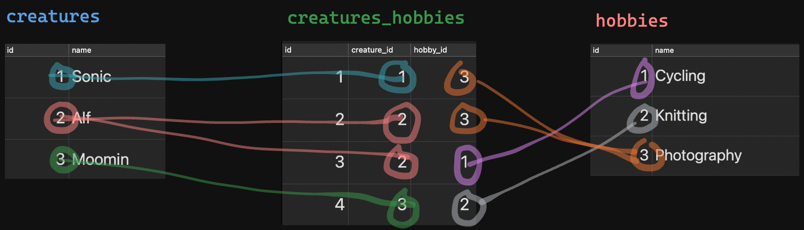
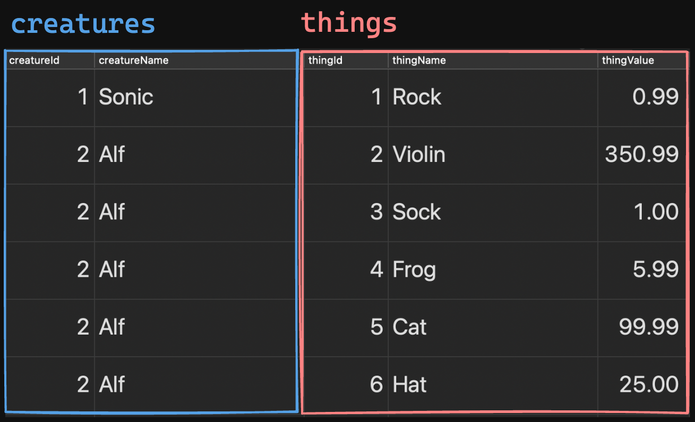

# Relational SQL: Part Two

Instructor Note: Keep building on top of the `"relational_sql"` database from Part One.

## Relationship Types!

### One-to-Many Relationship

The relationship between **creatures** and **things** is a one-to-many:

* A Creature can have many Things.
* A Thing can belong to only one Creature.

This is an example of a **One-to-Many** relationship. 

### One-to-One Relationship

The relationship between **states** and **capital_cities** is a one-to-one:

* A State can only have one Capital City.
* A Capital City belongs to one State.

Another common example of this: Citizens and Social-Security Numbers.

It's worth calling out that these aren't all that common.

### Many-to-Many Relationship

The relationship between **creatures** and **hobbies** is a many-to-many: 

* A Creature can have many Hobbies.
* A Hobby can be had by many Creatures.

Example: Sonic and Alf might both be into photography.

#### Let's Walk Through an Example

Here's the current state of our **creatures** table:

| id  | name     |
| --- | -------- |
| 1   | Sonic    |
| 2   | Alf      |
| 2   | Moomin   |

Let's invent a **hobbies** table that'll look like this:

| id | name        |
|----|-------------|
| 1  | Cycling     |
| 2  | Knitting    |
| 3  | Photography |

How could we model this:

* Sonic is into:
  * Photography
* Alf is into:
  * Photography
  * Cycling
* Moomin is into:
  * Knitting


Remember! We can't do this 👇, because it's the third anti-pattern we talked through at the beginning of the lecture.

| id | name        | creature_id |
|----|-------------| ----------- |
| 1  | Cycling     | 2           |
| 2  | Knitting    | 3           |
| 3  | Photography | 1,2         |

##### A "junction table" is what we need!

Instead, we create a "junction table" that'll exist "between" `"creatures"` and `"hobbies"`. Its entire job will be to store relationships between creatures and hobbies. (AKA: Every row in this table will be a record of a hobby had by a creature.)



#### Let's Try It Out

Make the `"hobbies"` and `"creatures_hobbies"` tables:

```sql
CREATE TABLE "hobbies" (
	"id" SERIAL PRIMARY KEY,
	"name" VARCHAR(100) NOT NULL
);

CREATE TABLE "creatures_hobbies" (
	"id" SERIAL PRIMARY KEY,
	"creature_id" INTEGER REFERENCES "creatures" ON DELETE CASCADE,
	"hobby_id" INTEGER REFERENCES "hobbies" ON DELETE CASCADE
);
```

Put data into them:

```sql
INSERT INTO "hobbies"
	("name")
	VALUES
	('Cycling'),
	('Knitting'),
	('Photography');
	
INSERT INTO "creatures_hobbies"
	("creature_id", "hobby_id")
	VALUES
	(1, 3), -- Sonic is into Photography.
	(2, 1), -- Alf is into Cycling.
	(2, 3), -- Alf is into Photography.
	(3, 2); -- Moomin is into Knitting.
```

Now, if we want to glue all three of these tables together to find out *which creatures have which hobbies*:

```sql
SELECT * FROM "creatures"
	JOIN "creatures_hobbies"
	  ON "creatures"."id" = "creatures_hobbies"."creature_id"
	JOIN "hobbies"
	  ON "creatures_hobbies"."hobby_id" = "hobbies"."id";
```

Woof. This was a lot. Don't sweat it, you're going to get lots of practice. 🙂

---

## We're Gonna Need Aliasing!

### The Problem:

Remember our first `JOIN` query and its result?

Query:

```sql
SELECT * FROM "creatures"
  JOIN "things"
    ON "creatures"."id" = "things"."creature_id";
```

Result:


Our result has two `"id"` columns and two `"name"` columns. Whatevs, right?

**Nope**. This is a problem. Because remember, over in JS-land, our query result lands back on our server as an array of objects. You know what we **definitely can't do** with a JS object? Have duplicate object properties:

```js
// Yeah, this isn't a thing.
{
  id: 2,
  name: 'Alf',
  id: 6,
  name: 'Hat',
  value: 25,
  creature_id: 2
}
```

What'll actually happen here, is that `id: 6` will **overwrite** `id: 2`, and `name: 'Hat'` will **overwrite** `name: 'Alf'`. Like this:

```js
// Whose Hat was that, again? We'll never know.
{
  id: 6,
  name: 'Hat',
  value: 25,
  creature_id: 2
}
```

### The Solution:

To prevent this, we'll need to **alias** (AKA: Rename!) the duplicate column names in our SQL query.

* Since we're aliasing things, let's be awesome at software development and:
  * Only select the columns that we actually want in our query result.
  * Use `"camelCase"` aliases so our JS code doesn't have to deal with underscores.

Query:

```sql
SELECT
  "creatures"."id" AS "creatureId", -- "column_we_want" AS "aliasWeDesire
  "creatures"."name" AS "creatureName",
  "things"."id" AS "thingId",
  "things"."name" AS "thingName",
  "things"."value" AS "thingValue" -- Didn't NEED to alias this, but it feels sensible
                                   -- so it's not ambiguous if the value applies to the
                                   -- creature or thing.
FROM "creatures"
  JOIN "things"
    ON "creatures"."id" = "things"."creature_id";
```

Result:



Now, when this query result lands back on our server as an array of objects, it'll be totally awesome. 😎 Because:

* No object properties are missing due to being overwritten by duplicate names.
* The object properties are `"camelCase"`, which our lil' JS hearts just love.

Remember how the final row in our query result was totally borked when we didn't alias the columns we'd selected?

```js
{
  id: 6,
  name: 'Hat',
  value: 25,
  creature_id: 2
}
```

It hath now been unborked. 🌈🦄🎉

```js
// Lovely.
{
  creatureId: 2,
  creatureName: 'Alf',
  thingId: 6,
  thingName: 'Hat',
  thingValue: 25
}
```
