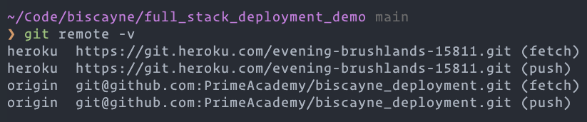

# Heroku Server + PostgreSQL Hosting for Personal Projects:

## Prerequisites

1. A [Heroku](https://www.heroku.com/) account, with:
    * An active subscription to the [Eco Dynos Plan](https://devcenter.heroku.com/articles/eco-dyno-hours#subscribing-to-the-eco-dynos-plan)
    * A credit card on file so that you can pay for the [Heroku Postgres Add-On](https://devcenter.heroku.com/categories/heroku-postgres).
2. An install of the Heroku CLI. (CLI: Command Line Interface)
    * `npm install -g heroku`
3. An install of [PostgreSQL's CLI Tools](https://postgresapp.com/documentation/cli-tools.html).
4. The ability to successfully authenticate with Heroku by typing `heroku login` in your Terminal.
    * This will prompt you to press a key and you'll be directed to log in through the Heroku web app.
5. The project you'd like to deploy must be a `git` repository. (Derp.)


## Repo Setup

Before you deploy, make sure your server `PORT` is configured correctly as:

```JavaScript
const PORT = process.env.PORT || 5001;
```

And make sure your `**modules/pool.js**` has some conditional code using `process.env.DATABASE_URL` like:

```js
if (process.env.DATABASE_URL) {
  config = {
    // We use the DATABASE_URL from Heroku to connect to our DB
    connectionString: process.env.DATABASE_URL,
    // Heroku also requires this special `ssl` config
    ssl: { rejectUnauthorized: false },
  };
} else {
  // If we're not on heroku, configure PG to use our local database
  config = {
    host: 'localhost',
    port: 5432,
    database: 'prime_app', // CHANGE THIS LINE to match your local database name!
  };
}
```

## Creating Your Heroku App

Run the following **terminal** commands from **within your project folder's root directory**.

1. `heroku create`
    * Log in in if prompted.
    * This will instantiate a Heroku app.
2. `git remote -v` to ensure it added successfully
    * You should see output like this. (AKA: This repo is a home on GitHub named `origin` and a home on Heroku named `heroku`.)
    * 
3. `heroku addons:create heroku-postgresql:essential-0`
    * Note: `essential-0` can be replaced with [whichever plan you prefer](https://devcenter.heroku.com/articles/heroku-postgres-plans#plan-tiers).


## Deploying Your Repo to Heroku

Run the following commands from **within your project folder's root directory**.

1. `heroku pg:push your_database DATABASE_URL`
    * Replace `your_database` with the actual name of your local PostgreSQL database.
    * This command effectively pushes up a **copy** of that database to Heroku.
    * If this doesn't work, ensure that you've installed [PostgreSQL's CLI Tools](https://postgresapp.com/documentation/cli-tools.html) and restarted your terminal!
2. `git push heroku main`
    * This will push your project repository up to Heroku.
3. That's deployment. If everything worked, `heroku open` should successfully open your app in the browser.


## Managing Your Deployment

### Common Commands

- `heroku logs` - Display the most recent Heroku-hosted server logs.
    - `heroku logs --tail` - Display Heroku-hosted server logs as they occur in real time.
- `heroku config` - Show basic app info.
- `heroku restart` - Sometimes it helps to turn things off an on again. 🙂
- `heroku open` - Opens the website for you project in the browser.


### Connect Postico to your Heroku Database

If you would like to view/edit your hosted database, you can actually use Postico!

1. From your [Heroku Dashboard](https://dashboard.heroku.com/apps), click your application.
2. Then, click the **Resources** tab.
3. In the **Add-ons** section, click **Heroku Postgres**.
4. Click the `Settings` tab, then click `View Credentials`
5. Open Postico, then click `New Favorite`.
6. In the new Postico favorite, update the following to match Heroku:
  - `Host`
  - `Database`
  - `User`
  - `Port`
  - `Password`
7. Click `Connect` and you should have access to your database directly from Postico!
